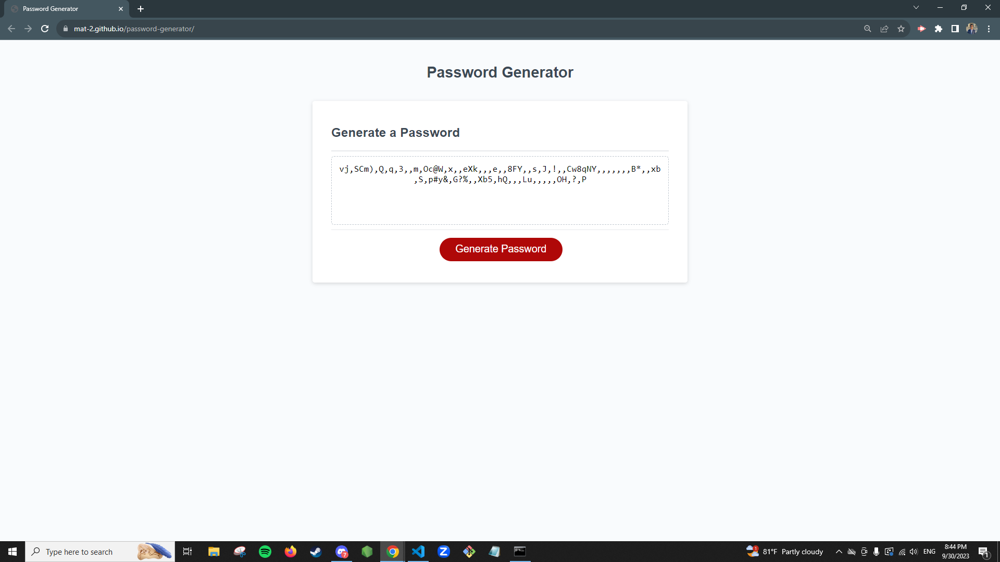

# password-generator

## Description

I had a fun time working on this project; this is how to create a password generator. In this project, I helped create a way where everytime that you press the button, the user will be given prompts and confirms asking the parameters of what their random password should be. It was fun learning to incorporate if statements and loops, but there was some difficulty when figuring out the methods needed. For instance, creating a way to both display the randomized password as well as calculating and choosing randomized characters based on the users' criteria was challenging. This did help reinforce the importance of using easy to read code to refer back and forth so it can be easily read, as well as being familiar with using different object methods, arrays, and functions to get this project to be completed.

## Installation

N/A

## License

Refer to LICENSE

## References

- https://www.w3schools.com/jsref/met_win_prompt.asp
- https://www.w3schools.com/jsref/met_win_confirm.asp
- https://www.w3schools.com/jsref/jsref_parseint.asp
- https://developer.mozilla.org/en-US/docs/Web/JavaScript/Reference/Operators/Logical_AND
- https://www.w3schools.com/jsref/jsref_push.asp
- https://developer.mozilla.org/en-US/docs/Web/JavaScript/Reference/Operators/Addition_assignment
- https://www.w3schools.com/js/js_operators.asp#:~:text=Assignment%20operators%20assign%20values%20to,a%20value%20to%20a%20variable.
- https://bobbyhadz.com/blog/javascript-convert-all-elements-of-array-to-lowercase
- https://stackoverflow.com/questions/5915096/get-a-random-item-from-a-javascript-array
- https://developer.mozilla.org/en-US/docs/Web/JavaScript/Reference/Global_Objects/Math/random
- https://developer.mozilla.org/en-US/docs/Web/JavaScript/Reference/Global_Objects/Math/floor

## Credits

- UT Austin FullStack Coding Bootcamp: Tutoring (Jili Jiang)

## Screenshots

